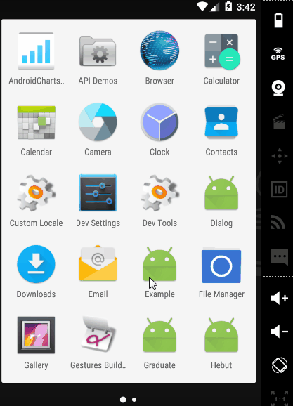

##### Welcome to visit:

GitHub: https://github.com/codezhanghao/

Blog: www.codezhang.com

---

# custom progressbar

这是一个简单的自定义控件项目：自定义进度条

通过继承系统的ProgressBar并重写onDraw()方法实现

效果：
<div class='row'>
        
</div>

---

# 自定义属性

### 水平进度条：HorizontalProgressBar

* progress_unreach_color  未到达进度条颜色

* progress_reach_color  已到达进度条颜色

* progress_unreach_height  未到达进度条高度，单位dp

* progress_reach_height  已到达进度条高度，单位dp

* progress_text_color  文本颜色

* progress_text_size  文本大小，单位sp

* progress_text_bar_space  文本与进度条之间的间隔

### 圆形进度条：RoundProgressBar

与水平进度条基本一致，就多出一个属性：

* progress_radius  半径，单位dp

# Usage

activity_main.xml

```xml
<com.hebut.czh.view.HorizontalProgressBar
            android:id="@+id/id_progressbar01"
            android:layout_width="match_parent"
            android:layout_height="wrap_content"
            android:progress="0"
            android:padding="15dp"
            android:layout_marginTop="30dp"
            czh:progress_text_color="#FF4081"
            czh:progress_reach_color="#FF4081"
            czh:progress_unreach_color="#44FF4081"/>
            
<com.hebut.czh.view.RoundProgressBar
            android:id="@+id/id_progressbar02"
            android:layout_width="match_parent"
            android:layout_height="wrap_content"
            android:progress="0"
            android:padding="15dp"
            android:layout_marginTop="30dp"
            czh:progress_radius="40dp"
            czh:progress_text_size="20sp"
            czh:progress_text_color="#000000"
            czh:progress_reach_color="#FF4081"
            czh:progress_unreach_color="#44FF4081"
            czh:progress_unreach_height="2dp"
            czh:progress_reach_height="4dp"/>
```

MainActivity.java

```java
public class MainActivity extends AppCompatActivity
{

    private HorizontalProgressBar mHorizontaPB;
    private RoundProgressBar mRoundPB;
    private ProgressRunnable mProgressRunnable;

    @Override
    protected void onCreate(Bundle savedInstanceState)
    {
        super.onCreate(savedInstanceState);
        setContentView(R.layout.activity_main);

        mHorizontaPB = (HorizontalProgressBar) findViewById(R.id.id_progressbar01);
        mRoundPB = (RoundProgressBar) findViewById(R.id.id_progressbar02);
        mProgressRunnable = new ProgressRunnable();
        mHorizontaPB.post(mProgressRunnable);
    }

    private class ProgressRunnable implements Runnable
    {
        @Override
        public void run()
        {
            int progress = mHorizontaPB.getProgress();
            if(progress >= 100) {
                mHorizontaPB.removeCallbacks(this);
                return;
            }
            mHorizontaPB.setProgress(++progress);
            mRoundPB.setProgress(progress);
            mHorizontaPB.postDelayed(this, 100);
        }
    }
}
```
